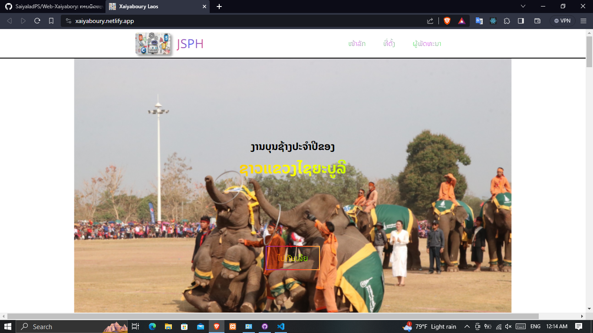
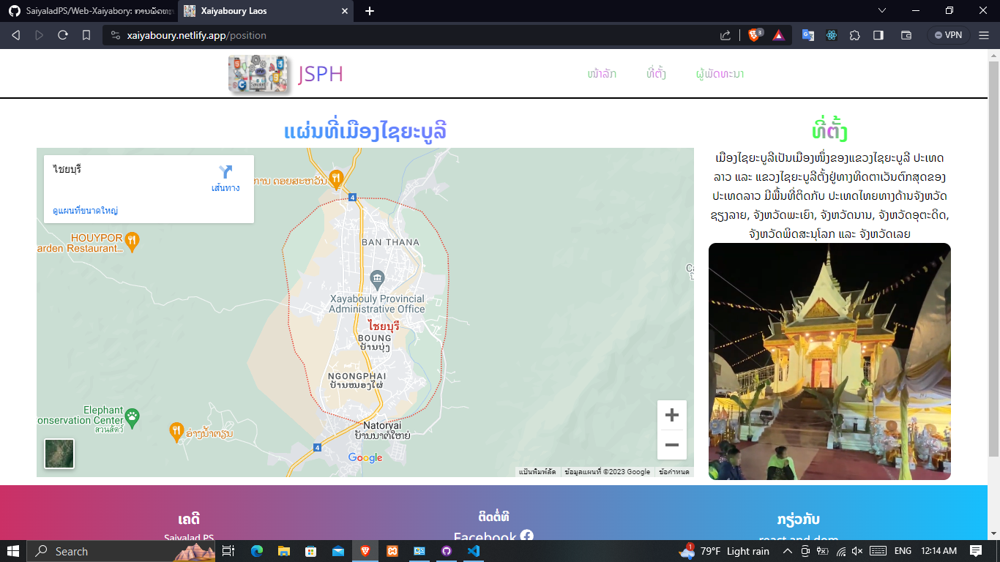

<!DOCTYPE html>
<html>
<head>
<link rel="preconnect" href="https://fonts.googleapis.com">
<link rel="preconnect" href="https://fonts.gstatic.com" crossorigin>
<link href="https://fonts.googleapis.com/css2?family=Noto+Sans+Lao:wght@300;500;800&display=swap" rel="stylesheet">
  <style>
    body {
      font-family: 'Noto Sans Lao', sans-serif;
      font-size: 16px;
      color: #fff;
    }
    h1, h2, h3, h4, h5, h6 {
      font-family: 'Noto Sans Lao', sans-serif;
    }
  </style>
</head>
<body>

# Web Xaiyaboury

> ອະທິບາຍເຖິງບັນຊ້າງທີ່ແຂວງໄຊຍະບູລີ

# Link Web

> https://xaiyaboury.netlify.app/

# Web Image

<div align="center">
</img>
</img>
</div>

# Create Project Vite

```bash
  npm create vite@latest project name
```

# 📦 Package name

```bash
 1 npm install react-dom
 2 npm install react-icons
 3 npm install react-router-dom
 4 npm install aos
```

<h1>ເຄືອງມຶ ແລະ ພາສາ</h1>
<div align="center">
</img>
</img>
</img>
</img>
<span style="font-size:35px">AOS</span>
</div>
